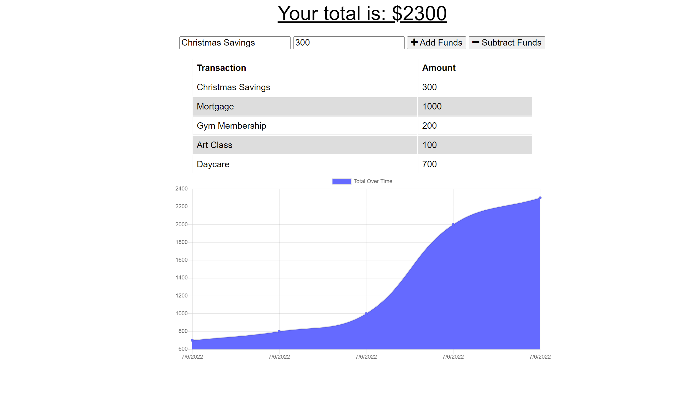

# Budget Tracker Starter Code
Progressive Web Applications (PWA) Challenge: Budget Tracker
---
## About

Giving users a fast and easy way to track their money is important, but allowing them to access that information at any time is even more important. Having offline functionality is paramount to the success of an application that handles users’ financial information.

---

### User Story
```
AS AN avid traveler
I WANT to be able to track my withdrawals and deposits with or without a data/internet connection
SO THAT my account balance is accurate when I am traveling 
```
---

### Criteria
```
GIVEN a budget tracker without an internet connection
WHEN the user inputs an expense or deposit
THEN they will receive a notification that they have added an expense or deposit
WHEN the user reestablishes an internet connection
THEN the deposits or expenses added while they were offline are added to their transaction history and their totals are updated
```
---

## Mock Up


---

### Installation
[REPO](https://github.com/lawalker4/thesocialapi/tree/develop)

[Express.js](https://expressjs.com/en/starter/installing.html)

[Mongoose](https://www.npmjs.com/package/mongoose)

[Heroku](www.heroku.com)

---

### Usage

To run application take the following steps:

-Clone repo to your computer.
-Open terminal and run npm i
-nom install mongoose
-Run npm start
-Using this link check out this application on Heroku


---

### Screenshot

:movie_camera:	




---

#### Author

:black_nib:	Built and maintain by [Ashley Walker](https://github.com/lawalker4)

---

#### Contact me with any questions you might have
:mailbox_with_mail:
Email: lauraashleywalker4@gmail.com
 